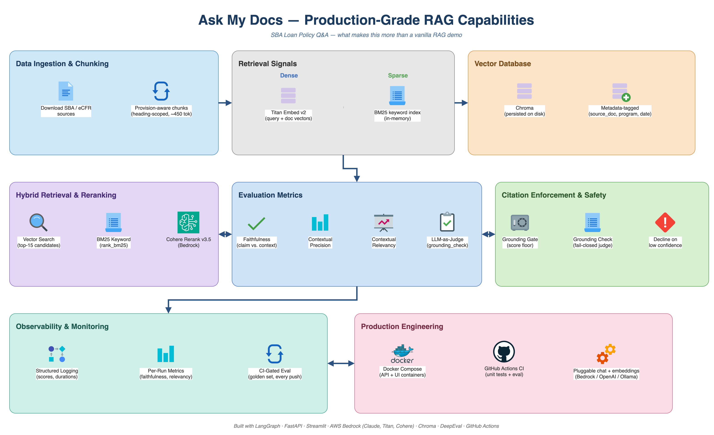
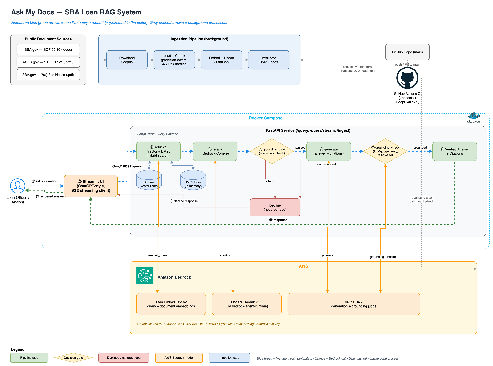

# Ask My Docs — SBA Loan Requirements

A retrieval-augmented question answering system over U.S. Small Business Administration lending rules.

Ask a question like *"What is the minimum equity injection for a change of ownership?"* and the system answers from the actual regulations — and shows you the exact source paragraphs it drew from. If the corpus does not contain the answer, it declines instead of guessing.

The corpus is three real SBA source documents, fetched from their official URLs at build time:

| Document | Type | Covers |
| --- | --- | --- |
| SOP 50 10 8.1 (effective 2026-10-01) | `.docx` | Lender operating procedures, eligibility, underwriting |
| 13 CFR Part 121 | `.html` | Small business size and affiliation standards |
| 7(a) Fee Notice FY 2026 | `.pdf` | Upfront guaranty and annual service fees |

## Why this project exists

Most RAG demos stop at "embed some text, stuff it in a prompt." The interesting problems start after that: knowing when *not* to answer, proving the answer came from the source, and catching quality regressions before they ship. This repo is built around those three concerns.

## Features

**Hybrid retrieval.** Every query runs both a dense vector search (Chroma) and a BM25 keyword search in parallel, then unions and de-duplicates the candidate pools. Dense search handles paraphrase; BM25 handles the exact statutory language — "Form 1050", "13 CFR 121.103" — that embeddings tend to blur.

**Cross-encoder reranking.** The ~30-candidate pool is re-scored against the question by Bedrock's hosted Cohere reranker (`cohere.rerank-v3-5:0`) and narrowed to the top 5. Candidates scoring below a relevance floor are dropped rather than padding the context to a fixed size.

**Two-stage grounding enforcement.** A cheap pre-generation gate declines immediately when nothing relevant was retrieved, skipping the expensive generation path entirely. After generation, a second LLM pass verifies that the drafted answer actually follows from the retrieved chunks. That check is *fail-closed*: any exception, timeout, or unparseable verdict resolves to "not grounded," never to "grounded."

**Citations as a first-class output.** Every answer carries the source document, effective date, program, and the verbatim chunk text behind it. The UI renders each one as an expandable panel, so a claim can always be traced back to a paragraph.

**Metadata-tagged chunks.** Chunks are tagged with `source_doc`, `effective_date`, and `program` — the fields that matter in a domain where the answer depends on which revision of the SOP is in force.

**CI-gated evaluation.** A 22-case golden set (18 answerable, 4 that should be declined) runs on every push. See [Evaluation](#evaluation) for what blocks a merge and what only gets tracked.



## Architecture

End to end — ingestion, the live query path (numbered ①–⑩), the Bedrock calls behind each step, and where CI fits:



The query path itself is a LangGraph state machine:

```
question ─▶ retrieve ─▶ grounding_gate ─▶ generate ─▶ grounding_check ─▶ answer
                │             │                             │
                │             ▼ nothing relevant            ▼ not supported by context
                │          decline                       decline
                │
                └─ vector search ∪ BM25 search ─▶ rerank ─▶ top 5 above relevance floor
```

| Layer | Path | Responsibility |
| --- | --- | --- |
| Ingestion | `ingestion/` | Download, parse, chunk, embed, upsert to Chroma |
| Pipeline | `pipeline/` | The LangGraph nodes and retrieval logic |
| API | `api/` | FastAPI service with Pydantic request/response schemas |
| UI | `ui/` | Streamlit app — a pure HTTP client, no pipeline logic |
| Config | `config/` | Prompts in version-controlled YAML, provider settings |
| Tests | `tests/` | Unit and contract tests, fully mocked (no network) |
| Eval | `eval/` | DeepEval golden set suite |

### Chunking

Chunks follow the document's own structure rather than a fixed token window. Each source exposes its headings differently, so the loader reads whichever signal is authoritative and the chunker works on the resulting sections:

| Source | Heading signal |
| --- | --- |
| SOP 50 10 (`.docx`) | Word paragraph styles (`Heading 1`–`Heading 5`); the table of contents is skipped |
| 13 CFR 121 (`.html`) | `<h1>`–`<h6>` tags inside the regulation container |
| Fee notice (`.pdf`) | No markup, so headings are detected heuristically and repeated page headers/footers are stripped |

Sections are then packed to a ~450-token target under an 800-token ceiling, splitting only on line boundaries so a cut never lands mid-provision. Small adjacent sections pack together instead of becoming tiny low-signal chunks; a section over the target is split across its own provisions.

Every chunk is prefixed with its heading path (`Section A > Chapter 4: Fees > Upfront Fee for EWCP loans`). That prefix rides in the chunk text rather than in metadata, so it reaches the embedding, the BM25 index, the generator's context and the citation shown to the user. Without it a chunk about EWCP fees may never contain the word "EWCP".

Both diagrams are editable — the `.drawio` sources live alongside the exports in [docs/diagrams/](docs/diagrams/) and open in [diagrams.net](https://app.diagrams.net) or the draw.io desktop app. The architecture diagram animates the query path when opened in the editor.

## Prerequisites

- **Python 3.11** (the version CI runs)
- **An AWS account with Amazon Bedrock access.** Reranking always calls Bedrock regardless of which provider you pick for chat and embeddings, so AWS credentials are required either way.
- Bedrock **model access granted** in your region for:
  - `cohere.rerank-v3-5:0` (reranking)
  - `amazon.titan-embed-text-v2:0` (embeddings)
  - `us.anthropic.claude-haiku-4-5-20251001-v1:0` (generation)
- An IAM identity with `bedrock:Rerank` and `bedrock:InvokeModel`

Model access is granted per-region in the Bedrock console and is not enabled by default — if you skip this step, the first query fails with an access-denied error.

## Running it after cloning

### 1. Install

```bash
git clone <your-fork-url>
cd Production-Grade-RAG

python3.11 -m venv .venv
source .venv/bin/activate        # Windows: .venv\Scripts\activate
pip install -r requirements.txt
```

### 2. Configure

```bash
cp .env.example .env
```

Then edit `.env`:

```dotenv
MODEL_PROVIDER=bedrock
AWS_ACCESS_KEY_ID=your-key
AWS_SECRET_ACCESS_KEY=your-secret
AWS_REGION=us-east-1
```

> **Note:** `.env.example` ships with `MODEL_PROVIDER=ollama` for local experimentation, but reranking calls Bedrock regardless. Set it to `bedrock` unless you specifically want Ollama handling chat and embeddings — and even then, fill in the AWS credentials.

`.env` is gitignored. Never commit real credentials.

### 3. Build the index

```bash
python -m ingestion.download_corpus     # fetches into data/raw/ (gitignored)

python -c "
import logging
logging.basicConfig(level=logging.INFO, format='%(name)s %(levelname)s %(message)s')
from ingestion.orchestrator import run_ingestion
run_ingestion()
"
```

This costs a few cents in embedding calls and takes roughly a minute. Expect output close to:

```
ingested source_doc=sop_50_10_8_1.docx        text_chars=906205  chunks=269
ingested source_doc=cfr_121_affiliation.html  text_chars=300589  chunks=94
ingested source_doc=notice_7a_fees_fy2026.pdf text_chars=9721    chunks=4
ingestion complete: sources=3 total_chunks=367
```

Ingestion fails loudly if a source extracts far less text than expected, rather than silently indexing a bot-check page. The vector store lands in `chroma_db/` (gitignored — it is a build artifact, not source).

### 4. Run

Two terminals, with the virtualenv active in both:

```bash
uvicorn api.main:app --reload       # API on http://localhost:8000
```

```bash
streamlit run ui/app.py             # UI on http://localhost:8501
```

Open <http://localhost:8501> and ask something like *"What is the SBA upfront guaranty fee for a $5 million 7(a) loan?"*

### Or with Docker

```bash
cp .env.example .env    # edit it as above first
docker compose up --build
```

Same ports. `chroma_db/` and `data/` are bind-mounted, so an index you built on the host is reused — if you have not built one yet, call `POST /ingest` once the API is up.

## API

| Endpoint | Method | Purpose |
| --- | --- | --- |
| `/query` | POST | Ask a question, get answer + citations + grounded flag |
| `/query/stream` | POST | Same, delivered as Server-Sent Events |
| `/ingest` | POST | Rebuild the index from `data/raw/` |

```bash
curl -X POST http://localhost:8000/query \
  -H 'Content-Type: application/json' \
  -d '{"question": "What is the FY 2026 annual service fee?"}'
```

```json
{
  "answer": "The FY 2026 Lender's Annual Service Fee is 0.55% of the outstanding balance ...",
  "citations": [
    {
      "source_doc": "notice_7a_fees_fy2026.pdf",
      "effective_date": "2025-08-28",
      "program": "7(a)",
      "chunk_text": "..."
    }
  ],
  "grounded": true
}
```

Interactive docs are at <http://localhost:8000/docs>.

**On `/query/stream`:** it is a progressive *replay*, not live token generation. The full graph — including the grounding check — completes server-side before the first token is sent. This is deliberate: it means the endpoint can never show text that the grounding check has not already approved. You trade first-token latency for the guarantee that nothing unverified ever reaches the screen.

## Testing

```bash
pytest              # unit + API contract tests — fully mocked, no network, no credentials
```

```bash
pytest eval/        # golden set evaluation — needs AWS credentials, ~7 minutes, real Bedrock spend
```

`pyproject.toml` scopes the default `testpaths` to `tests/`, so a bare `pytest` never triggers billed calls by accident.

## Evaluation

`eval/golden_qa.json` holds 22 hand-written cases with reference answers and the source document each should cite. The suite deliberately splits into two tiers:

**Hard gates — these fail the build.** Both assert on deterministic pipeline state, not model judgment:
- an answerable question must produce `grounded=True`
- it must cite the expected source document
- a `should_decline` question must produce `grounded=False`

**Tracked signals — these warn but do not block.** Three DeepEval metrics judged by Claude on Bedrock: Faithfulness, Contextual Precision, and Contextual Relevancy.

They are non-blocking on purpose. During development the judge was measurably the less reliable component: on one case it flagged a hallucination against a clause present *verbatim* in the retrieved context, and its claim-extraction step had silently dropped that clause. Gating a build on a judge that behaves that way converts every judge error into a false build failure. Tracking the scores keeps the signal — which is genuinely useful — without handing the merge decision to the least trustworthy part of the loop.

A `NonAdvice` metric was tried and removed: in a regulatory-explainer domain it scored 0.0 on accurate restatements of SBA policy, which is exactly what the system is supposed to produce.

**What the tracked metrics currently say.** Moving from uniform 800-token windows to provision-aware chunking produced this, measured over the same 18 answerable cases:

| Metric | Uniform 800-token windows | Provision-aware chunks |
| --- | --- | --- |
| Faithfulness | 14 cases below threshold | **8** |
| Contextual Precision | 1 case below threshold | **0** |
| Contextual Relevancy | 11 cases below threshold | **12** |

Faithfulness and Precision improved clearly. Contextual Relevancy did not — which is worth stating plainly, because it was the metric the change was aimed at.

The likely reason is that Relevancy measures the *proportion* of retrieved statements that bear on the question, and retrieval still returns a fixed `TOP_K = 5` regardless of how many chunks actually help. Smaller, cleaner chunks make each one more focused but do not change the ratio when four of the five are adjacent provisions. The lever for that is adaptive `TOP_K` or a higher per-chunk relevance floor, not chunk boundaries — see [Known limitations](#known-limitations).

## CI

`.github/workflows/ci.yml` runs two jobs on every push and PR to `main`:

1. **`unit-tests`** — `pytest tests/`, no credentials needed
2. **`eval`** — gated behind the first job: downloads the corpus, builds the vector store, runs `pytest eval/`

The eval job needs three repository secrets (**Settings → Secrets and variables → Actions**): `AWS_ACCESS_KEY_ID`, `AWS_SECRET_ACCESS_KEY`, and `AWS_REGION`. Repository secrets are encrypted, kept out of git history, and masked in logs — unlike a committed `.env`, which is why credentials live there and not in the repo.

Note that CI rebuilds the index from scratch on every run and makes real Bedrock calls, so each run takes about 10 minutes and costs real money.

## Known limitations

- **Retrieval always returns `TOP_K = 5` chunks**, however many actually bear on the question, so the context is padded with adjacent provisions. This is the remaining cause of the Contextual Relevancy scores above; adaptive `TOP_K` or a higher relevance floor is the fix.
- **The grounding gate threshold is not empirically calibrated.** It is a conservative starting value chosen from observed rerank score distributions, not tuned against labelled data. The same value doubles as the per-chunk relevance floor, where `0.2` is permissive.
- **PDF heading detection is heuristic.** A PDF carries no structural markup, so headings are inferred from line length, capitalisation and a trailing colon. It works on the fee notice; a differently formatted notice may need the rules revisited.
- **The BM25 index is per-process and in-memory.** It rebuilds on first use after ingestion invalidates it, which does not survive horizontal scaling.
- **Corpus URLs are pinned to specific document revisions.** When the SBA publishes a new SOP, `ingestion/manifest.py` needs updating.
